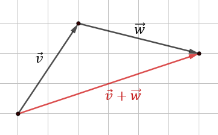

# Fizyka

- teacher: dr Anna Mozrzymas
- email: anna.mozrzymas@upwr.edu.pl
- teacher_usos: https://usos.upwr.edu.pl/kontroler.php?_action=katalog2/osoby/pokazOsobe&os_id=17099
- teacher_researchgate: https://www.researchgate.net/profile/Anna-Mozrzymas
- teacher_orcid: none
- subject_link: https://sylabus.upwr.edu.pl/pl/6/2/4/5/41

# Literatura

- S. Przestalski: Elementy fizyki, biofizyki i agrofizyki, Wydawnictwo Uniwersytetu Wrocławskiego, Wrocław 2001
- H. Kleszczyńska, M. Kilian, J. Kuczera (red): Laboratorium fizyki, biofizyki i agrofizyki, Wyd. UP, Wrocław, 2008
- R. Resnik, D. Halliday „Fizyka” tom I i II, PWN, Warszawa 1999
- R. Resnick, D. Halliday, J. Walker: Podstawy Fizyki, Tom I-V, PWN, Warszawa, 2019

---

## Wymagania dotyczące uczestnictwa w zajęciach

- Znajomośc tematu który jest na cwiczeniach - bez tego nie można uczestniczyc w ćwiczeniach.

---

# Zaliczenie

## Wykład

Kolokwium / potencjalne wejściówki

## Ćwiczenia

 

### Wykaz cwiczeń

- Ćw. 2: Wyznaczanie gęstości i ciężaru właściwego ciał stałych
- Ćw. 16: Sprawdzenie prawa Hooke'a oraz wyznaczenie modułu Younga
- Ćw. 7: Badanie przepływu cieczy przez poziome rurki
- Ćw. 9: Wyznaczanie współczynnika przewodności wodnej
- Ćw. 11: Pomiar współczynnika napięcia powierzchniowego
- Ćw. 14: Wyznaczanie współczynnika lepkości
- Ćw. 19: Wyznaczanie ciepła właściwego ciał stałych
- Ćw. 23: Pomiar zmiany entropii w procesie samorzutnym
- Ćw. 24: Wyznaczanie linii ekwipotencjalnych pola elektrostatycznego
- Ćw. 25: Wyznaczanie oporu przewodnika
- Ćw. 35: Badanie widm pierwiastków za pomocą spektroskopu
- Ćw. 37: Badanie zjawisk fotoelektrycznych zewnętrznych

---

# Daty

TBD

---

# Tematy

## Ćwiczenia 1 (14.10.23r.)

### Wektory

- http://www.daktik.rubikon.pl/podstawy_punkt_mat/wektory_wstep.htm
- https://teoriaelektryki.pl/wielkosci-wektorowe-i-skalarne/
- http://www.daktik.rubikon.pl/podstawy_punkt_mat/wektory_dodawanie_graficzne.htm
- http://www.daktik.rubikon.pl/podstawy_punkt_mat/wektory_odejmowanie_graficzne.htm
-

- Dodawanie wektorów
  $$
  \vec{a} + \vec{b} = \vec{c}
  $$

  - Metoda trójkąta
    

  - Metoda rombu
     

- Odejmowanie wektorów
  $$
  \vec{a} - \vec{b} = \vec{a} + (-\vec{b})
  $$

  - Metoda trójkąta
  - Metoda rombu

- Mnożenie wektorów
  $$
  \vec{a} \cdot \vec{b} = \vec{c}
  $$
- Mnożenie wektorów przez skalary
  $$
  \vec{F} = m\cdot\vec{a} = 2kg\cdot 5{,}1\ \frac{m}{s^2} = [10{,}2]\ N
  $$

## Wykład 1 (14.10.23r.)

### Zjawisko fizyczne

- https://pl.wikipedia.org/wiki/Zjawisko_fizyczne

### Wielkości fizyczne

- podstawowe i pochodne
- skalarne i wektorowe

### Układ SI

- https://pl.wikipedia.org/wiki/Uk%C5%82ad_SI
- http://www.daktik.rubikon.pl/jednostki/jednostki_podstawowe_si.htm

| Nazwa     | Symbol  | Mierzona wielość  |
| --        | --      |                -- |
| metr      | m       | długość           |
| kilogram  | kg      | masa              |
| sekunda   | s       | czas              |
| amper     | A       | prąd elektryczny  |
| kelwin    | K       | temperatura       |
| mol       | mol     | liczność materii  |
| kandela   | cd      | światłość         |

### Mechanika

- Kinematyka (jak coś się porusza)
  - http://www.daktik.rubikon.pl/kinematyka/spis_kinematyka.htm
- Dynamika (dlaczego coś się porusza)
  - http://www.daktik.rubikon.pl/dynamika/spis_dynamika.htm

### Ruch postępowy

- https://pl.wikipedia.org/wiki/Ruch_(fizyka)

- Prostolinijny
  - https://pl.wikipedia.org/wiki/Ruch_jednostajny_prostoliniowy?wprov=srpw1_0
- Krzywolinijny

### Wektor położenia (wodzący)

- http://www.daktik.rubikon.pl/podstawy_punkt_mat/pm_3_wektor_wodzacy.htm

### Ruch krzywoliniowy

$$
\vert\Delta \vec{r}\vert < S
$$

### Ruch prostolinijny

$$
\vert\Delta \vec{r}\vert = S
$$

### Prędkość liniowa

$$
\vec{V}_{śr} = \left\lvert \frac{\Delta \vec{r}}{\Delta t} \right\rvert \le \frac{S}{\Delta t} \left[\frac{m}{s} \right]
$$

#### Prędkość chwilowa

- http://www.daktik.rubikon.pl/kinematyka/predkosc_chwilowa.htm

$$
\Delta t \to 0
$$

$$
\vec{V}_{chwil} = \lim_{\Delta t\to 0} \frac{\Delta \vec{r}}{\Delta t} = \frac{d\vec{r}}{dt}
$$

#### Granica

- https://pl.wikipedia.org/wiki/Granica_funkcji

#### Sieczna

- https://pl.wikipedia.org/wiki/Sieczna

### Przyspieszenie

- http://www.daktik.rubikon.pl/kinematyka/przyspieszenie.htm#PrzyspieszenieCzyliZmianyPr%C4%99dko%C5%9Bci

$$
\frac{\Delta \vec{v}}{\Delta t}
\left[\frac{\frac{m}{s}}{s} = \frac{m}{s^2}\right]
$$

#### Chwilowe

$$
\vec{a}_{chwil} = \lim_{\Delta t\to 0} \frac{\Delta \vec{v}}{\Delta t} = \frac{d\vec{v}}{dt}
$$

#### Hodograf prędkości

- https://pl.wikipedia.org/wiki/Hodograf

#### Styczne

- https://pl.wikipedia.org/wiki/Styczna?wprov=srpw1_3

---
