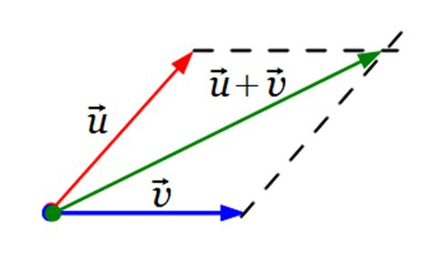
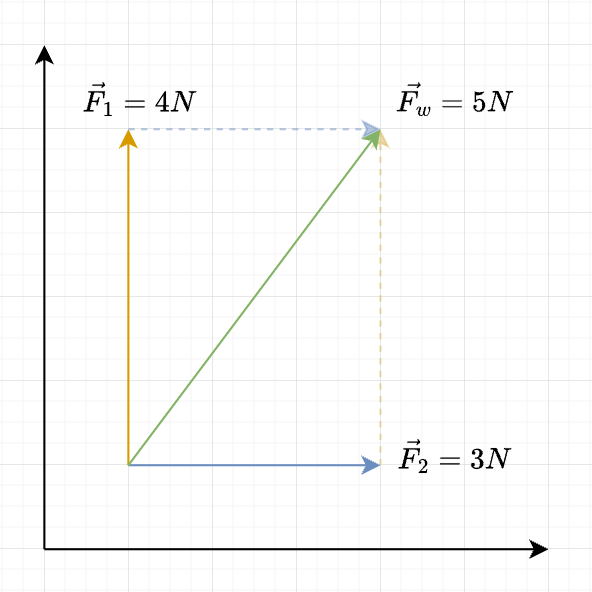

# Fizyka

- teacher: dr Anna Mozrzymas
- email: anna.mozrzymas@upwr.edu.pl
- teacher_usos: https://usos.upwr.edu.pl/kontroler.php?_action=katalog2/osoby/pokazOsobe&os_id=17099
- teacher_researchgate: https://www.researchgate.net/profile/Anna-Mozrzymas
- teacher_orcid: none
- subject_link: https://sylabus.upwr.edu.pl/pl/6/2/4/5/41

# Literatura

- S. Przestalski: Elementy fizyki, biofizyki i agrofizyki, Wydawnictwo Uniwersytetu Wrocławskiego, Wrocław 2001
- H. Kleszczyńska, M. Kilian, J. Kuczera (red): Laboratorium fizyki, biofizyki i agrofizyki, Wyd. UP, Wrocław, 2008
- R. Resnik, D. Halliday „Fizyka” tom I i II, PWN, Warszawa 1999
- R. Resnick, D. Halliday, J. Walker: Podstawy Fizyki, Tom I-V, PWN, Warszawa, 2019

---

## Wymagania dotyczące uczestnictwa w zajęciach

- Znajomośc tematu który jest na cwiczeniach - bez tego nie można uczestniczyc w ćwiczeniach.

---

# Zaliczenie

## Wykład

Kolokwium / potencjalne wejściówki

## Ćwiczenia

 

### Wykaz cwiczeń

- Ćw. 2: Wyznaczanie gęstości i ciężaru właściwego ciał stałych
- Ćw. 16: Sprawdzenie prawa Hooke'a oraz wyznaczenie modułu Younga
- Ćw. 7: Badanie przepływu cieczy przez poziome rurki
- Ćw. 9: Wyznaczanie współczynnika przewodności wodnej
- Ćw. 11: Pomiar współczynnika napięcia powierzchniowego
- Ćw. 14: Wyznaczanie współczynnika lepkości
- Ćw. 19: Wyznaczanie ciepła właściwego ciał stałych
- Ćw. 23: Pomiar zmiany entropii w procesie samorzutnym
- Ćw. 24: Wyznaczanie linii ekwipotencjalnych pola elektrostatycznego
- Ćw. 25: Wyznaczanie oporu przewodnika
- Ćw. 35: Badanie widm pierwiastków za pomocą spektroskopu
- Ćw. 37: Badanie zjawisk fotoelektrycznych zewnętrznych

---

# Daty

TBD

---

# Tematy

## Ćwiczenia 1 (14.10.23r.)

### Wektory

- http://www.daktik.rubikon.pl/podstawy_punkt_mat/wektory_wstep.htm
- https://teoriaelektryki.pl/wielkosci-wektorowe-i-skalarne/
- http://www.daktik.rubikon.pl/podstawy_punkt_mat/wektory_dodawanie_graficzne.htm
- http://www.daktik.rubikon.pl/podstawy_punkt_mat/wektory_odejmowanie_graficzne.htm

- Dodawanie wektorów
  $$
  \vec{a} + \vec{b} = \vec{c}
  $$

  - Metoda trójkąta
    

  - Metoda rombu
     

- Odejmowanie wektorów
  $$
  \vec{a} - \vec{b} = \vec{a} + (-\vec{b})
  $$

  - Metoda trójkąta
  - Metoda rombu

- Mnożenie wektorów
  $$
  \vec{a} \cdot \vec{b} = \vec{c}
  $$
- Mnożenie wektorów przez skalary
  $$
  \vec{F} = m\cdot\vec{a} = 2kg\cdot 5{,}1\ \frac{m}{s^2} = [10{,}2]\ N
  $$

## Ćwiczenia 2 (21.10.23r.)

### Zadanie 1

Zapisać w podstawowych jednostkach układu SI:

a. $1015 mm^3$
  - $1mm^3 = 10^{-9}\ m^3$
  - $1015mm^3 = 1015 \cdot 10^{-9}\ m^3 = 1{,}015 \cdot 10^{-6}\ m^3$

b. $25 km/h$
  - $1\ km = 1000\ m$
  - $1\ h = 3600\ s$
  - $25\ km/h = 25\ \frac{km}{h} = 25\ \frac{1000\ m}{3600\ s} = 6\frac{25}{36}\ \frac{m}{s} = 6{,}94\ \frac{m}{s}$

c. $7\frac{g}{cm \cdot s}$
  - $1\ g = 10^{-3}\ kg$
  - $1\ cm = 10^{-2}\ m$
  - $7\frac{g}{cm \cdot s} = 7\frac{10^{-3}\ kg}{10^{-2}\ m\cdot s} = 0{,}7\frac{kg}{m\cdot s}$

d. $10^{-2} hg$ (hektogram)
  - $1\ hg = 10^{-1}\ kg$
  - $10^{-2} hg = 10^{-2}\cdot 10^{-1}\ kg = 10^{-3}\ kg$

### Zadanie 2

Współczynnik lepkości $\eta\ [Pa\cdot s]$ może być wyrażony wzorem:

$$
\eta = \frac{2 \cdot r^2 (p - p_c) \cdot g \cdot t}{9 \cdot h}
$$

gdzie: $r [m]$, $p$ i $p_c [kg/m^3]$, $g [m/s^2]$, $t [s]$, $h [m]$.

Pokazac ze $\eta$ jest wyrazone w $[Pa\cdot s]$.

- $[Pa] = \frac{[kg]}{[m\cdot s^2]}$
- $[s] = [s]$
- $$
  \eta [Pa\cdot s] = \frac{[kg]}{[m\cdot s^2]} \cdot [s] = \frac{[kg]}{[m\cdot s]}
  $$
- $$
  \begin{aligned}
  \eta &= \frac{2 \cdot r^2 (p - p_c) \cdot g \cdot t}{9 \cdot h} \\
  &= \frac{[m^2] \cdot \frac{[kg]}{[m^3]} \cdot \frac{[m]}{[s^2]} \cdot [s]}{[m]} \\
  &= \frac{[m \cdot m] \cdot [\frac{kg}{m\cdot m \cdot m}] \cdot [\frac{m}{s \cdot s}]\cdot [s]}{[m]} \\
  &= [m] \cdot [\frac{kg}{m \cdot m \cdot m}] \cdot [\frac{m}{s \cdot s}]\cdot [s] \\
  &= [\frac{kg}{m \cdot m}] \cdot [\frac{m}{s^2}]\cdot [s] \\
  &= [\frac{kg}{m \cdot m}] \cdot [\frac{m}{s}] \\
  &= \frac{[kg]}{[m\cdot s]}
  \end{aligned}
  $$

### Zadanie 3

Pływak płynie, zwrócony stale prostopadle do nurtu rzeki, z prędkością własną równą
$v_1 = 0.3 m/s$. Prędkość nurtu rzeki względem układu odniesienia związanego z lądem
wynosi $v_2 = 0.4 m/s$. Z jaką prędkością względem układu związanego z lądem porusza
się pływak. Proszę podać wartość i przedstawić graficznie układ prędkości.

- $v_1 = 0{,}3\ \frac{m}{s}$
- $v_2 = 0{,}4\ \frac{m}{s}$
- $$
  \begin{aligned}
  v_3 &= \sqrt{v_1^2 + v_2^2} \\
  &= \sqrt{0{,}3^2 + 0{,}4^2} \\
  &= \sqrt{0{,}09 + 0{,}16} \\
  &= \sqrt{0{,}25} \\
  &= 0{,}5\ \frac{m}{s}
  \end{aligned}
  $$
-  

### Zadanie 4

Samochód, który poruszał się początkowo z prędkością $v_0 = 10 m/s$ zwiększył swą
prędkość do wartości $v = 20 m/s$. Przebył w tym czasie drogę $S = 300m$. Oblicz czas ruchu $t$ i przyspieszenie $a$.

- $v_0 = 10\ \frac{m}{s}$
- $v_1 = 20\ \frac{m}{s}$
- $S = 300\ m$
- $$
  \begin{aligned}
  S &= \frac{v_1^2 - v_0^2}{2a} \\
  S \cdot 2a &= v_1^2 - v_0^2 \\
  2a &= \frac{v_1^2 - v_0^2}{S} \\
  a &= \frac{\frac{v_1^2 - v_0^2}{S}}{2} \\
  &= \frac{\frac{400-100}{300}}{2} \\
  &= \frac{\frac{300}{300}}{2} \\
  &= \frac{1}{2} [\frac{m}{s^2}]
  \end{aligned}
  $$
- $$
  \begin{aligned}
  t &= \frac{v_1 - v_0}{a} \\
  &= \frac{20 - 10}{\frac{1}{2}} \\
  &= \frac{10}{\frac{1}{2}} \\
  &= 10 \cdot 2 \\
  &= 20s
  \end{aligned}
  $$

### Zadanie 5

Lampa o ciężarze $Q = m\cdot g$ wisi na sznurze przytwierdzonym do sufitu. Korzystając z
I i III zasady dynamiki Newtona zbadaj i narysuj wszystkie siły występujące w
układzie: `lampa - sznur - sufit`. (Masę sznura zaniedbujemy).

- http://www.daktik.rubikon.pl/dynamika/dyn_1_zasada_dynamiki_uklady_inercjalne.htm
- http://www.daktik.rubikon.pl/dynamika/dyn_trzecia_zas_dynamiki_newtona.htm

- $F_{sufit} = F_a$
- $F_{sznur} = F_b$
- $F_{lapma} = F_c$

- $Q = m\cdot g$
- $m = 1\ kg$
- $g = 9{,}81\ \frac{m}{s^2}$

- $$
  \begin{aligned}
  Q &= m\cdot g \\
  &= 1\ kg \cdot 9{,}81\ \frac{m}{s^2} \\
  &= 9{,}81N
  \end{aligned}
  $$
-  

- Na sufit działają siły:  siła grawitacji $Q$ oraz $F_{ab}$.
- Na sznur działają siły: siła grawitacji $Q$, $F_{ba}$ i $F_{bc}$.
- Na lampę działają siły: siła grawitacji $Q$ i $F_{cb}$.

### Zadanie 6

Na ciało o masie $1kg$ działają dwie siły, skierowane prostopadle względem siebie, o
wartościach $F_1 = 4 N$ i $F_2 = 3N$. Wyznacz konstrukcyjnie i rachunkowo wektor siły
wypadkowej. Ile wynosi przyspieszenie tego ciała?

- $m = 1\ kg$
- $\vec{F_1} = 4N$
- $\vec{F_2} = 3N$
- $$
  \begin{aligned}
  F_{w} &= \sqrt{F_1^2 + F_2^2} \\
  &= \sqrt{4^2 + 3^2} \\
  &= \sqrt{16 + 9} \\
  &= \sqrt{25} \\
  &= 5N
  \end{aligned}
  $$
-  

## Wykład 1 (14.10.23r.)

### Zjawisko fizyczne

- https://pl.wikipedia.org/wiki/Zjawisko_fizyczne

### Wielkości fizyczne

- podstawowe i pochodne
- skalarne i wektorowe

### Układ SI

- https://pl.wikipedia.org/wiki/Uk%C5%82ad_SI
- http://www.daktik.rubikon.pl/jednostki/jednostki_podstawowe_si.htm

| Nazwa     | Symbol  | Mierzona wielość  |
| --        | --      |                -- |
| metr      | m       | długość           |
| kilogram  | kg      | masa              |
| sekunda   | s       | czas              |
| amper     | A       | prąd elektryczny  |
| kelwin    | K       | temperatura       |
| mol       | mol     | liczność materii  |
| kandela   | cd      | światłość         |

### Mechanika

- Kinematyka (jak coś się porusza)
  - http://www.daktik.rubikon.pl/kinematyka/spis_kinematyka.htm
- Dynamika (dlaczego coś się porusza)
  - http://www.daktik.rubikon.pl/dynamika/spis_dynamika.htm

### Ruch postępowy

- https://pl.wikipedia.org/wiki/Ruch_(fizyka)

- Prostolinijny
  - https://pl.wikipedia.org/wiki/Ruch_jednostajny_prostoliniowy?wprov=srpw1_0
- Krzywolinijny

### Wektor położenia (wodzący)

- http://www.daktik.rubikon.pl/podstawy_punkt_mat/pm_3_wektor_wodzacy.htm

### Ruch krzywoliniowy

$$
\vert\Delta \vec{r}\vert < S
$$

### Ruch prostolinijny

$$
\vert\Delta \vec{r}\vert = S
$$

### Prędkość liniowa

$$
\vec{V}_{śr} = \left\lvert \frac{\Delta \vec{r}}{\Delta t} \right\rvert \le \frac{S}{\Delta t} \left[\frac{m}{s} \right]
$$

#### Prędkość chwilowa

- http://www.daktik.rubikon.pl/kinematyka/predkosc_chwilowa.htm

$$
\Delta t \to 0
$$

$$
\vec{V}_{chwil} = \lim_{\Delta t\to 0} \frac{\Delta \vec{r}}{\Delta t} = \frac{d\vec{r}}{dt}
$$

#### Granica

- https://pl.wikipedia.org/wiki/Granica_funkcji

#### Sieczna

- https://pl.wikipedia.org/wiki/Sieczna

### Przyspieszenie

- http://www.daktik.rubikon.pl/kinematyka/przyspieszenie.htm#PrzyspieszenieCzyliZmianyPr%C4%99dko%C5%9Bci

$$
\frac{\Delta \vec{v}}{\Delta t}
\left[\frac{\frac{m}{s}}{s} = \frac{m}{s^2}\right]
$$

#### Chwilowe

$$
\vec{a}_{chwil} = \lim_{\Delta t\to 0} \frac{\Delta \vec{v}}{\Delta t} = \frac{d\vec{v}}{dt}
$$

#### Hodograf prędkości

- https://pl.wikipedia.org/wiki/Hodograf

#### Styczne

- https://pl.wikipedia.org/wiki/Styczna?wprov=srpw1_3

---
