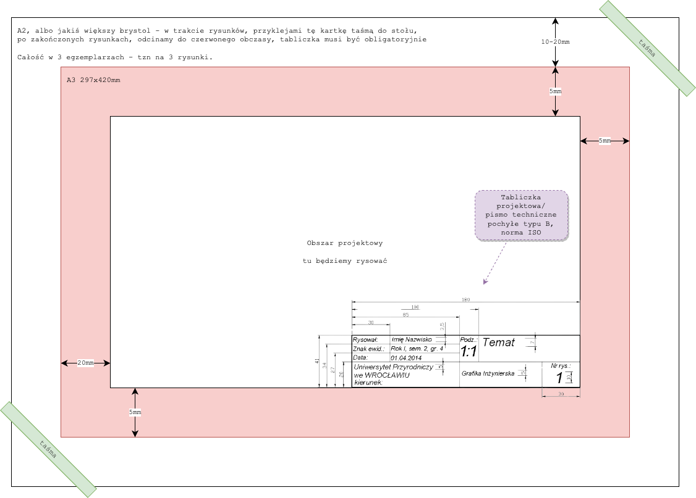
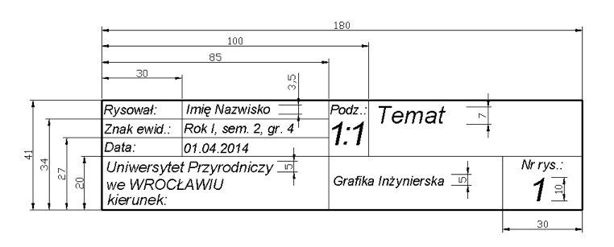
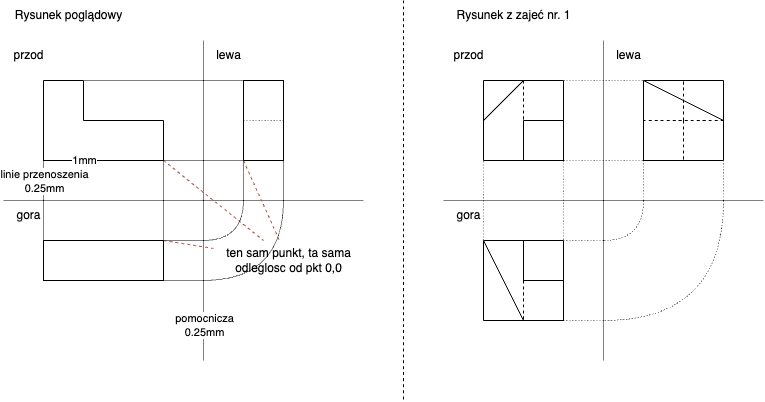

# Grafika inżynierska

- teacher: dr inż. Beata Cieniawska
- email: beata.cieniawska@upwr.edu.pl
- teacher_usos: https://usos.upwr.edu.pl/kontroler.php?_action=katalog2/osoby/pokazOsobe&os_id=17355
- teacher_researchgate: https://www.researchgate.net/profile/Beata-Cieniawska
- teacher_orcid: none
- subject_link: https://sylabus.upwr.edu.pl/pl/6/2/4/5/41
- tel: 713205714 (gabinet); 666988949 (kom); 8:00-20:00
- jak ktoś się spóźni to ma nie wchodzic na zajecia, moze za to dołaczyc na zajecia z druga grupa

# Literatura

- BRAK.

---

# Zaliczenie 3 rysunki + kolos z autocada na pozytywną ocenę

## Wymagania dotyczące uczestnictwa w zajęciach

- Ołówek zwykły i automatyczny 0,5 HB
- Gumka
- Linijka 30-40cm
- Ekierka
  - 45°x45°x90°
  - 30°x60°x90°
- Cyrkiel
- Temperówka
- Taśma klejąca
- Nożyczki
- Arkusz, brystol A2/A1/A0

---

# Zaliczenie

TBD

# Tematy

## Cwiczenia 1 (15.10.23r.)

BRAK.

## Cwiczenia 2 (22.10.23r.)

### Zadania

- Rzutowanie
- Przekroje
- Wymiarowanie

Jeden Rysunek do odrobienia na extra zajęciach:

- 19.11 - rzutowanie
- 26.11 - przekroje + wymiarowanie (dwa zajęcia z grafiki inzynierskiej, mozliwosc przedluzenia zajec po 17:15)

### Formaty

- A4 = 210x297mm
- A3 = 297x420mm

### Przygotowanie papieru:

 

### Tabliczka projektowa

 

### Rodzaje linii

- 0.25mm - lekkie przyciśnięcie ołówka do kartki
- 0.5mm - normalne przyciśnięcie ołówka do kartki
- 1.0mm - mocne przyciśnięcie ołówka do kartki

### rozroznienie linia gruba vs linia cienka

- linia ciagla gruba - zarysy przedmiotow 0.5mm
- linia ciagla cienka - linie pomocnicze 0.25mm
- linia kreskowa cienka - linia niewidoczna / zaslanieta

### Rzutowanie 2 wymiary i 3 wymiary:

- jezeli przedmiot jest prosty - dwa rzuty
- jezeli przedmiot jest skomplikowany - trzy rzuty

### Metody rzutowania

- metoda europejcka - ta jest dla nas
- metoda amerykanska

### Cwiczenia z rzutowania

 

Przy pokazywaniu lewej strony i prawej strony rysunku, robimy lustrzane odbicie horyzontalne i zamieniamy wewnętrzne linie miejscami - to co było linią ciągłą, zamienia się w linię przerywaną a to co było przerywaną, zamienia się w ciągłą.
